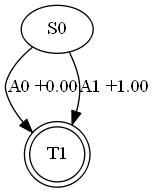

# MDP environments for the OpenAI Gym

This Python framework makes it very easy to specify simple MDPs.

[](https://travis-ci.org/BlackHC/mdp)

## Installation

To install using pip, use:

```
pip install blackhc.mdp
```

To run the tests, use:

```
python setup.py test
```

## Whitepaper

A whitepaper is available at [docs/whitepaper.pdf](docs/whitepaper.pdf). Here is a BibTeX entry that you can use in publications (or download [CITE_ME.bib](CITE_ME.bib)):
```
@techreport{blackhc.mdp,
    Author = {Andreas Kirsch},
    Title = {MDP environments for the OpenAI Gym},
    Year = {2017},
    Url = {http://github.com/BlackHC/mdp/raw/master/docs/whitepaper.pdf}
}
```


## Introduction

In reinforcement learning, agents learn to maximize accumulated rewards from an environment that they can interact with by observing and taking actions. Usually, these environments satisfy a Markov property and are treated as *Markov Decision Processes* (*MDPs*).

The OpenAI Gym is a standardized and open framework that provides many different environments to train agents against through a simple API.

Even the simplest of these environments already has a level of complexity that is interesting for research but can make it hard to track down bugs. However, the gym provides four very simple environments that are useful for testing. The `gym.envs.debugging` package contains a one-round environment with deterministic rewards and one with non-deterministic rewards, and a two-round environment with deterministic rewards and another one with non-deterministic rewards.
The author has found these environments very useful for smoke-testing code changes.

This Python framework makes it very easy to specify simple MDPs like the ones described above in an extensible way. With it, one can validate that agents converge correctly as well as examine other properties.

## Specification of MDPs

MDPs are Markov processes that are augmented with a reward function and discount factor. An MDP can be fully specified by a tuple of:

* a finite set of states,
* a finite set of actions,
* a matrix that specifies probabilities of transitions to a new state for a given a state and action,
* a reward function that specifies the reward for a given action taken in a certain state, and
* a discount rate.

The reward function can be either deterministic, or it can be a probability distribution.

Within this framework, MDPs can be specified in Python using a simple *domain-specific language* (*DSL*).
For example, the one-round deterministic environment defined in `gym.envs.debugging.one_round_deterministic_reward` could be specified as follows:

```python
from blackhc.mdp import dsl

start = dsl.state()
end = dsl.terminal_state()

action_0 = dsl.action()
action_1 = dsl.action()

start & (action_0 | action_1) > end
start & action_1 > dsl.reward(1.)
```

The DSL is based on the following grammar (using EBNF[@ebnf]): 

    TRANSITION ::= STATE '&' ACTION '>' OUTCOME
    OUTCOME ::= (REWARD | STATE) ['*' WEIGHT]
    ALTERNATIVES ::= ALTERNATIVE ('|' ALTERNATIVE)* 
    
For a given state and action, outcomes can be specified. Outcomes are state transitions or rewards.
If multiple state transitions or rewards are specified for the same state and action, the MDP is non-deterministic and the state transition (or reward) are determined using a categorical distribution. By default, each outcome is weighted uniformly, except if specified otherwise by either having duplicate transitions or by using an explicit weight factor. 

For example, to specify that a state receives a reward of +1 or -1 with equal probability and does not change states with probability 3/4 and only transitions to the next state with probability 1/4, we could write:
   
```python
state & action > dsl.reward(-1.) | dsl.reward(1.)
state & action > state * 3 | next_state
```

Alternatives are distributive with respect to both conjunctions (`&`) and outcome mappings (`>`), so:

    (a | b) & (c | d) > (e | f) ===
    (a & c > e) | (a & c > f) | (a & d > e) | 
    (a & d > f) | (b & c > e) | ... 

Alternatives can consist of states, actions, outcomes, conjunctions or partial transitions. For example, the following are valid alternatives:

    stateA & actionA | stateB & actionB
    (actionA > stateC) | (actionB > stateD)

As the DSL is implemented within Python, operator overloading is used to implement the semantics. Operator precedence is favorable as `*` has higher precedence than `&`, which has higher precedence than `|`, which has higher precedence than `>`. This allows for a natural formulation of transitions.

## Conventional API

The framework also supports specifying an MDP using a conventional API as DSLs are not always preferred.

```python
from blackhc import mdp

spec = mdp.MDPSpec()
start = spec.state('start')
end = spec.state('end', terminal_state=True)
action_0 = spec.action()
action_1 = spec.action()

spec.transition(start, action_0, mdp.NextState(end))
spec.transition(start, action_1, mdp.NextState(end))
spec.transition(start, action_1, mdp.Reward(1))
```

## Visualization

To make debugging easier, MDPs can be converted to `networkx` graphs and rendered using `pydotplus` and `GraphViz`.

```python
from blackhc import mdp
from blackhc.mdp import example

spec = example.ONE_ROUND_DMDP

spec_graph = spec.to_graph()
spec_png = mdp.graph_to_png(spec_graph)

mdp.display_mdp(spec)
```

<div>

</div>
<b>Figure 1: One round deterministic MDP</b>

## Optimal values

The framework also contains a small module that can compute the optimal value functions using linear programming.

```python
from blackhc.mdp import lp
from blackhc.mdp import example

solver = lp.LinearProgramming(example.ONE_ROUND_DMDP)
print(solver.compute_q_table())
print(solver.compute_v_vector())
```

## Gym environment

An environment that is compatible with the OpenAI Gym can be created easily by using the `to_env()` method. It supports rendering into Jupyter notebooks, as RGB array for storing videos, and as png byte data.

```python
from blackhc import mdp
from blackhc.mdp import example

env = example.MULTI_ROUND_NMDP.to_env()

env.reset()
env.render()

is_done = False
while not is_done:
    state, reward, is_done, _ = env.step(env.action_space.sample())
    env.render()
```

<div>

</div>
<b>Figure 2: env.render() of `example.MULTI_ROUND_NMDP`</b>

# Examples

The `blackhc.mdp.example` package provides 5 MDPs. Four of them match the ones in `gym.envs.debugging`, and the fifth one is depicted in figure 2. 
